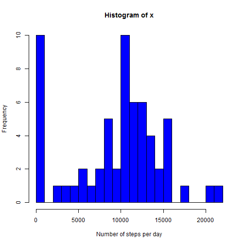
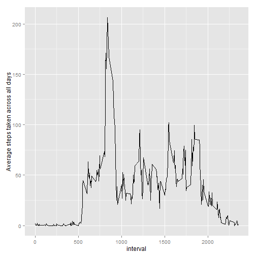
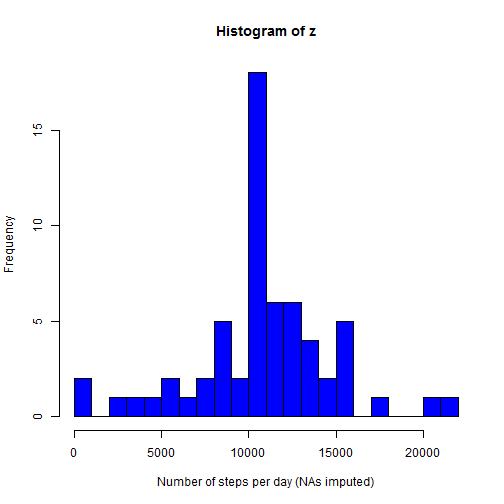
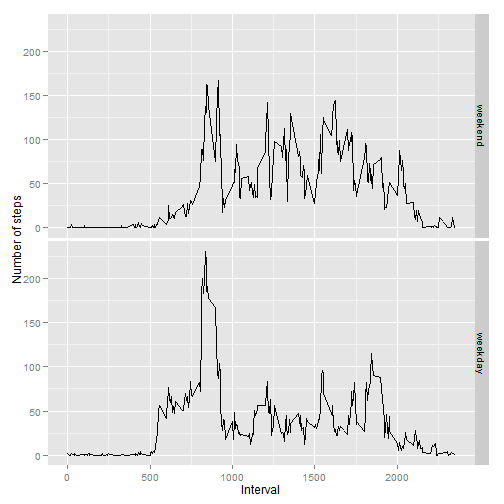

### Assignment 1
### Reproducible Research

Activity monitoring data from a personal activity monitoring device, collected at 5 minute intervals throughout the day.   Two month data for October and November 2012.  

variables in the dataset:  
- steps: number of steps taking in a 5-minute interval  
- date: date on which the measurement was taken in YYYY-MM-DD  
- interval: identifier for the 5-minute interval  

Loading the data set  


```r
data <- read.csv("activity.csv")
```

#### Mean Total number of steps taken per day  

Histogram  

```r
x <- tapply(data$steps, data$date, sum, na.rm=TRUE)
hist(x, breaks = 30, col="blue", xlab = "Number of steps per day")
```

 

Mean  

```r
mean(x)
```

```
## [1] 9354.23
```

Median    

```r
median(x)
```

```
## [1] 10395
```

#### Average Daily Activity Pattern

Time Series Plot  

```r
int.data <- aggregate(data$steps, list(interval = data$interval), mean, na.rm =TRUE)
colnames(int.data) <- c("interval", "avesteps")

library(ggplot2)
g <- ggplot(int.data, aes(x = interval, y = avesteps))
g + geom_line() + labs(y = "Average steps taken across all days")
```

 

Maximum 5-minute interval

```r
subset(int.data, select=interval, subset=(avesteps == max(int.data$avesteps, na.rm=TRUE)))
```

```
##     interval
## 104      835
```

#### Imputing missing values

Total number of rows with missing values in the dataset: data

```r
sum(is.na(data$steps))
```

```
## [1] 2304
```

Strategy to impute missing values:  
Replace mising value (NAs) with the mean average steps of that interval  

New Dataset (new.data) with missing data filled-in

```r
new.data <- data
rows <- nrow(new.data)

for (i in 1:rows) {
    if (is.na(new.data[i,]$steps)){
       
        na.int <- new.data[i,]$interval
        new <- as.numeric(subset(int.data, select=avesteps ,subset=(interval==na.int)))
        new.data[i,]$steps <- new
    }
}
```

Checking NAs in the new dataset: new.data

```r
sum(is.na(new.data$steps))
```

```
## [1] 0
```

Histogram of the total number of steps taken each day

```r
z <- tapply(new.data$steps, new.data$date, sum, na.rm=TRUE)
hist(z, breaks = 30, col="blue", xlab = "Number of steps per day (NAs imputed)")
```

 

Mean  

```r
mean(z)
```

```
## [1] 10766.19
```

Median    

```r
median(z)
```

```
## [1] 10766.19
```

The median and mean differ after imputing NAs. The value as both increased.  
  

#### Differences in activity patterns between weekdays and weekends

```r
days <- weekdays(as.Date(new.data$date))
new.col <- days
rows <- length(new.col)

for (i in 1:rows){
    if (new.col[i] %in% c("Sunday", "Saturday")) {
        new.col[i] <- "weekend"    
    } else{
        new.col[i] <- "weekday"    
    }
    
}

ndata <- cbind(new.data, new.col)
str(ndata)
```

```
## 'data.frame':	17568 obs. of  4 variables:
##  $ steps   : num  1.717 0.3396 0.1321 0.1509 0.0755 ...
##  $ date    : Factor w/ 61 levels "2012-10-01","2012-10-02",..: 1 1 1 1 1 1 1 1 1 1 ...
##  $ interval: int  0 5 10 15 20 25 30 35 40 45 ...
##  $ new.col : Factor w/ 2 levels "weekday","weekend": 1 1 1 1 1 1 1 1 1 1 ...
```

```r
head(ndata)
```

```
##       steps       date interval new.col
## 1 1.7169811 2012-10-01        0 weekday
## 2 0.3396226 2012-10-01        5 weekday
## 3 0.1320755 2012-10-01       10 weekday
## 4 0.1509434 2012-10-01       15 weekday
## 5 0.0754717 2012-10-01       20 weekday
## 6 2.0943396 2012-10-01       25 weekday
```

#### Panel Plot

```r
ndata.weekend <- subset(ndata, subset=(new.col=="weekend"))
weekend <- aggregate(ndata.weekend$steps, list(interval = ndata.weekend$interval), mean)
nrow(weekend)
```

```
## [1] 288
```

```r
daytype <- rep("weekend",nrow(weekend))
we <- cbind(weekend, daytype)

ndata.weekday <- subset(ndata, subset=(new.col=="weekday"))
weekday <- aggregate(ndata.weekday$steps, list(interval = ndata.weekday$interval), mean)
daytype <- rep("weekday",nrow(weekday))
wd <- cbind(weekday, daytype)

plot.data <- rbind(we, wd)
colnames(plot.data) <- c("Interval", "Number_of_steps", "DayType")

library(ggplot2)
g <- ggplot(plot.data, aes(x = Interval, y = Number_of_steps))
g + geom_line() + labs(y = "Number of steps") + facet_grid(DayType ~ .)
```

 


